# gitpod-superset-steampipe-postgresql
Gitpod workspace for Apache Superset combined with Steampipe and PostgreSQL

[](https://gitpod.io/#https://github.com/lucasjellema/gitpod-superset-steampipe-postgresql)

Once the workspace is up and running, 
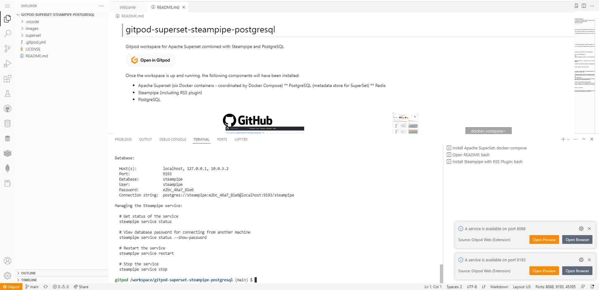  

the following components will have been installed:

* Apache Superset (six Docker containers - coordinated by Docker Compose)
** PostgreSQL (metadata store for SuperSet)
** Redis
* Steampipe (including RSS plugin)
* PostgreSQL 

This picture shows the contents of the workspace:
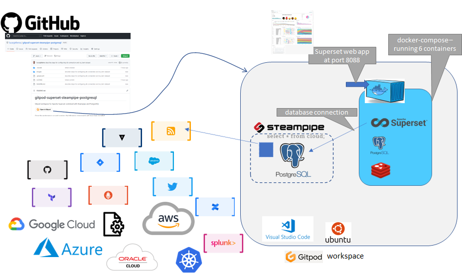  

# Steampipe

Once the workspace has fully started and Steampipe is available, you can execute batch-mode (non-interactive) queries like this one:

```
steampipe query "select title, link, description from rss_channel where feed_link = 'https://technology.amis.nl/feed/'"
```
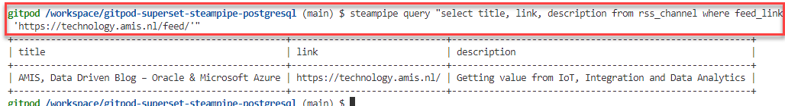  

to query details about the RSS feed published for the AMIS Technology Blog. This next query will list title, publication timestamp and URL for the most recent articles on the AMIS blog (latest first):

```
steampipe query "
select
  title,
  published,
  link
from
  rss_item
where
  feed_link = 'https://technology.amis.nl/feed/'
order by 
  published desc;
"
```
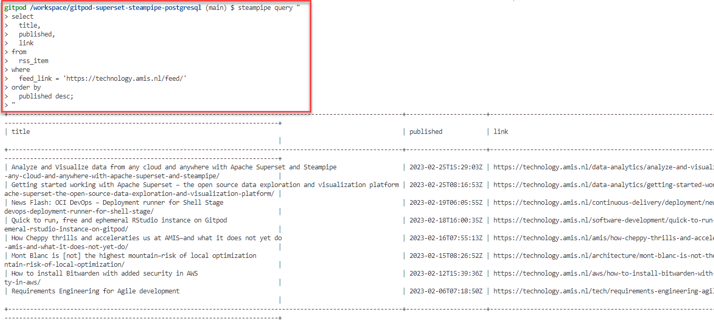  
Other properties available in the RSS_ITEM "view" include author_name and email, image_title and image_url, categories, description and content. Let's see if we can inspect these properties in Superset.

### CSV Plugin

The CSV plugin for Steampipe has also been installed. Additionally, the CSV plugin configuration (see `~/.steampipe/config`) has been defined to consider all CSV files in folder `/workspace/gitpod-superset-steampipe-postgresql/data` as sources for Steampipe tables. Steampipe therefore knows about a table called `trips` based on csv file `trips.csv`.

You can query data from that table (and therefore that csv file) using:

```
steampipe query "select \"Trip ID\", \"Start date\", \"End date\", \"Destination\" from trips"
```

In order to look at data from Steampipe in Superset, we first need to add a database connection in Superset to Steampipe's PostgreSQL database.

# Superset - and Connection to Steampipe

Open port 8088 to enter the Superset web UI. 
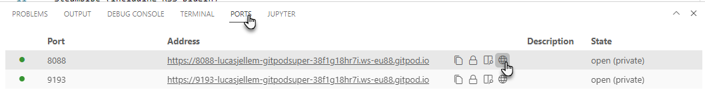  

Login with user admin and password admin.

Click on the plus icon. In the dropdown list select *Data*. In the child menu, click on *Connect database*.

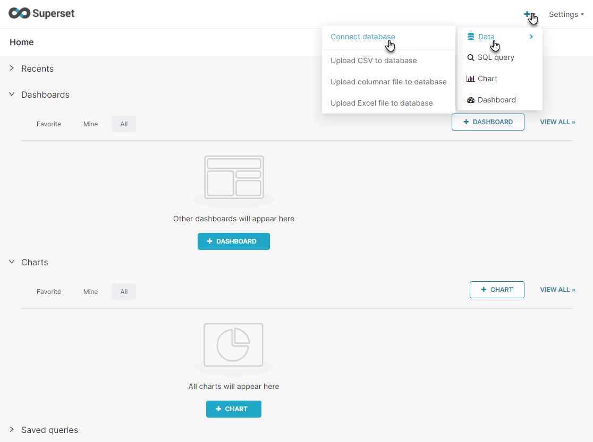  

The Database Connection configuration wizard appears. Click on the PostgreSQL tile.

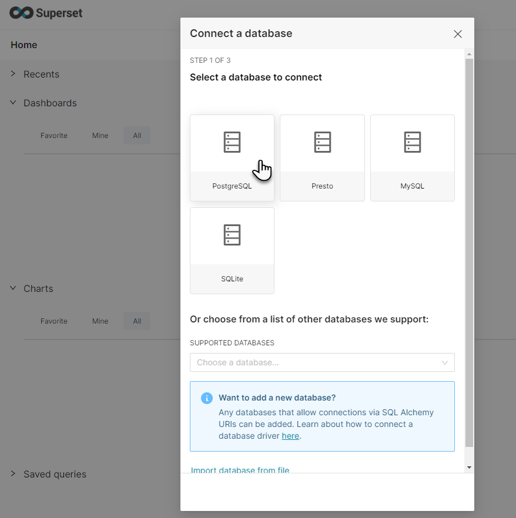  

 To configure the connection to the PostgreSQL database that Steampipe is running on, enter the following values:

* Host: 172.18.0.1
* Port: 9193
* database name: steampipe
* user: steampipe
* password: check in terminal window where steampipe was installed (or run: `steampipe service status --show-password `)
* Display Name: anything you like, for example *Steampipe* 

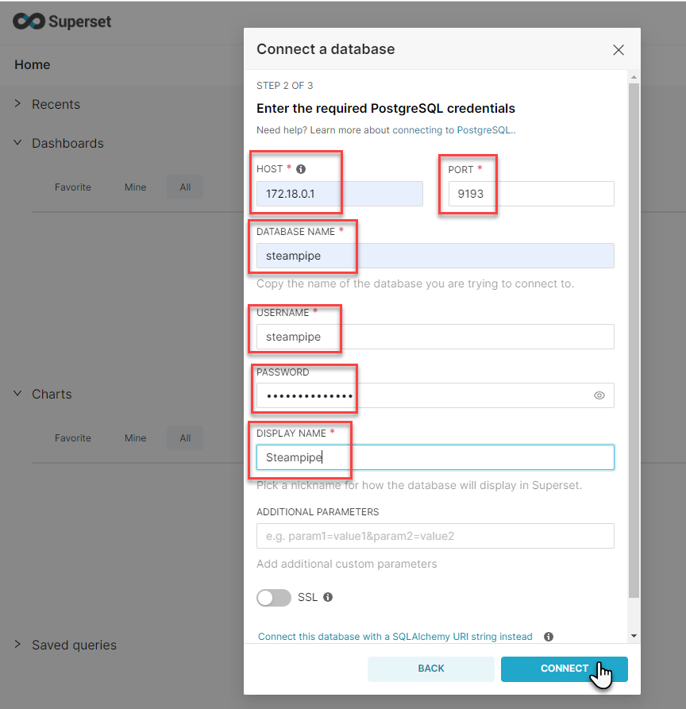  

The password created for the *steampipe* user can be seen in the terminal window labeled *Install Steampipe with RSS Plugin*:
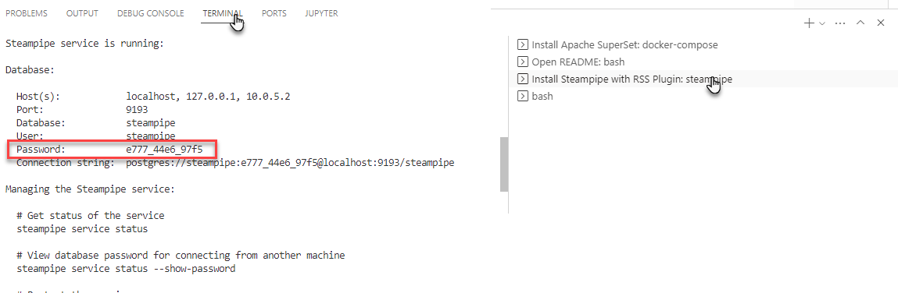  

Click on the Connect button.

A window appears that indicates that the database has been connected. Press the Finish button.
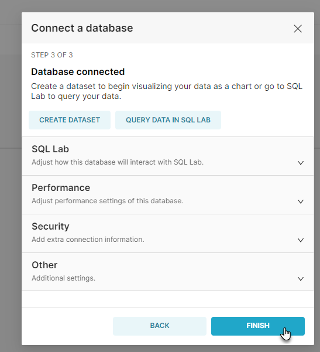  


## Define Dataset and Chart

Define the Dataset rss_item based on the "table" *rss_item* in the *rss* schema in the *Steampipe* database. Note: *rss_item* is not actually a table, but it is interpreted by Superset as one. For the purposes of what we are doing that is completely fine.

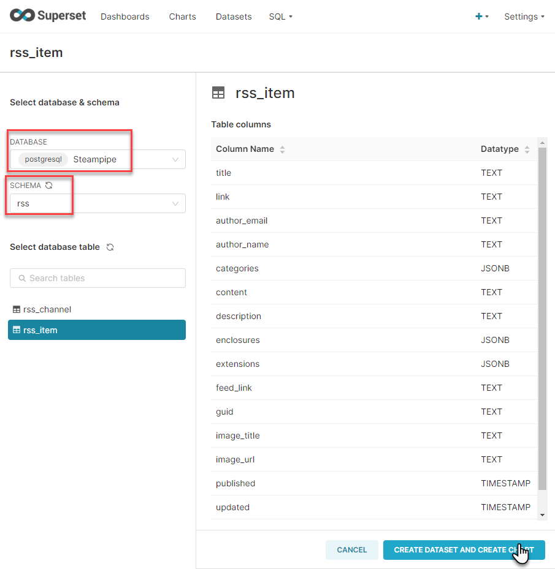  

We have not yet specified from which RSS Feed this data set should draw its data. We will define that through a filter on the data set that is defined as part of the chart definition. Alternatively we can define a View in the PostgreSQL database that selects from RSS_ITEM and contains the filter on feed_link.

Click on the button "Create Dataset and Create Chart".

The Chart editor is opened with the RSS_ITEM dataset already selected.

In the next screenshot, you see how the columns title, author_name and published are dragged to the *columns* box. Note that the toggle *Raw Records* is set. And very importantly: the filter condition has been specified: feed_link = https://technology.amis.nl/feed/

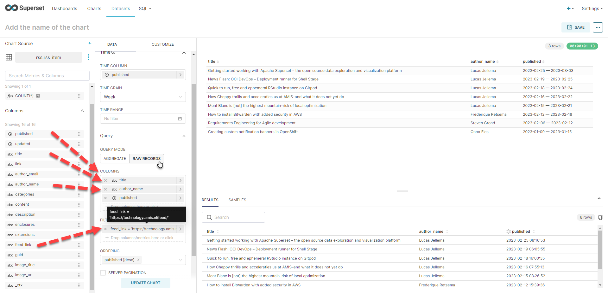  

Click on "Update Chart" to see the data that is the result of the selection and filtering specified.

Now let's turn it into a proper chart - one that shows us the number of articles published over the last few weeks.

Set the chart type to *Time Series Line*. Make sure the Time Granularity is set to Week (and the Time Column should be *published* ). The aggregate operator for the *title* metric should be *count*.

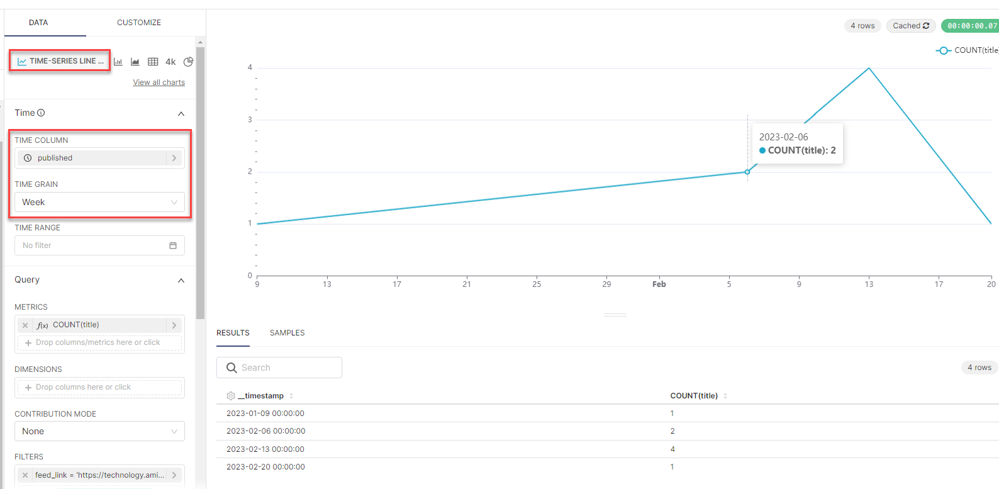  

A litte editing of the chart - to set titles on the axes - is easily done:
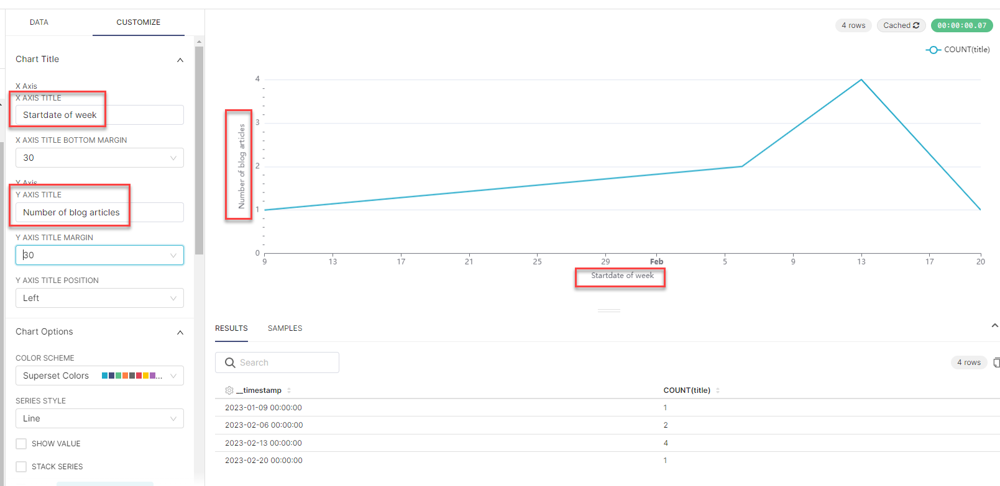  

## Analyze the BCC News Top Stories Newsfeed

If we want to work with data from a different RSS feed, we only have to modify the filter condition for the feed_link column. Here we switch from the AMIS Technology Blog feed to the feed that publishes the most recent BBC News Top Stories: http://feeds.bbci.co.uk/news/rss.xml 

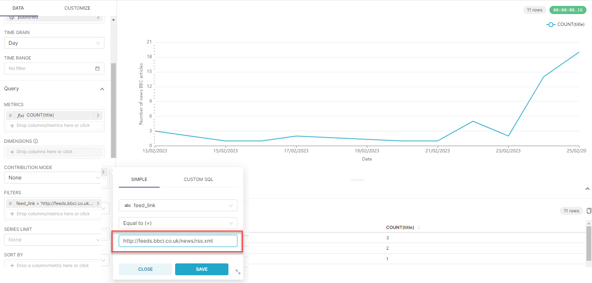  


# Load Data into PostgreSQL database

install PSQL - client for PostgreSQL
```
sudo apt-get update
sudo apt-get install postgresql-client -y
```

Connect through psql to the PostgreSQL database that Steampipe has started:

```
psql -h localhost -p 9193 -U steampipe -W -d steampipe
```
You are prompted for the password. You can learn about this password using `steampipe service status --show-password`

Once connected to the database, query data from table trips (which is in fact csv file trips.csv)

```
select "Trip ID", "Start date", "End date", "Destination" from trips;
```


Let's create a real table with proper data types and constraints to hold the data from the CSV file:

-- Create a new table to store the data
CREATE TABLE trips_history (
  trip_id INTEGER,
  destination VARCHAR(255),
  start_date DATE,
  end_date DATE,
  duration INTEGER,
  traveler_name VARCHAR(255),
  traveler_age INTEGER,
  traveler_gender VARCHAR(10),
  traveler_nationality VARCHAR(255),
  accommodation_type VARCHAR(255),
  accommodation_cost DECIMAL(10, 2),
  transportation_type VARCHAR(255),
  transportation_cost DECIMAL(10, 2)
);

-- Insert the data from the CSV file into the table
WITH trips_with_date_converted
 AS (
  SELECT 
    cast("Trip ID" as integer) as trip_id, 
    "Destination" as destination, 
    TO_DATE("Start date", 'MM/DD/YYYY') AS start_date, 
    TO_DATE("End date", 'MM/DD/YYYY') AS end_date, 
    cast("Duration (days)" as integer) as duration, 
    "Traveler name" as traveler_name, 
    cast("Traveler age" as integer) as traveler_age, 
    "Traveler gender" as traveler_gender, 
    "Traveler nationality" as traveler_nationality, 
    "Accommodation type" as accommodation_type, 
    cast("Accommodation cost" AS NUMERIC(10,2) ) as accommodation_cost, 
    "Transportation type" as transportation_type, 
    cast("Transportation cost"  AS NUMERIC(10,2)) as transportation_cost 
  FROM trips
)
INSERT INTO trips_history (trip_id, destination, start_date, end_date, duration
, traveler_name, traveler_age, traveler_gender, traveler_nationality
, accommodation_type, accommodation_cost, transportation_type, transportation_cost) 
SELECT trip_id, destination, start_date, end_date, duration
, traveler_name, traveler_age, traveler_gender, traveler_nationality
, accommodation_type, accommodation_cost, transportation_type, transportation_cost
from trips_with_date_converted;
```

In Superset, create a a dataset for table `trips_history` in *public* schema in database *Steampipe*. 

Then create for example chart Scatterplot, Calendar Heatmap.